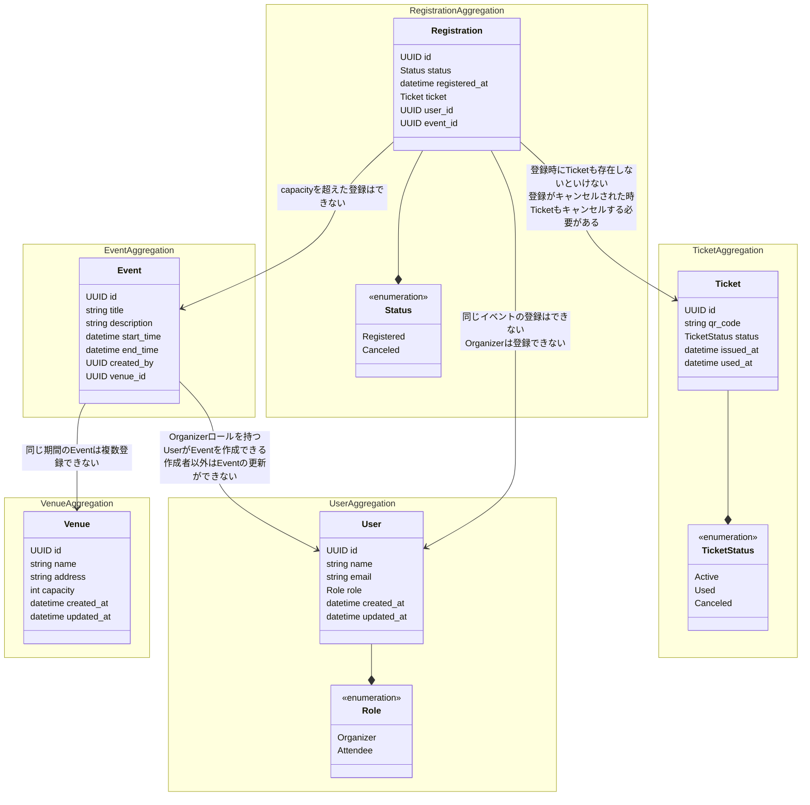

# ドメインモデル図

# 集約とは何か

集約を簡単に表すと**リポジトリへの入出力単位**のこと。

つまり集約ないのエンティティは常に一緒に作成、更新が行われる。

なのでエンティティ間に確保したい整合性がある場合、それらを集約として一つのまとまりとする。

# なぜ集約を使うのか？

結論、実装の手間を省きコードを簡潔にするため。

上記のドメインモデル図を例に仮にエンティティごとをそれぞれ集約として仮定した場合、

UseCase層が複雑になり、実装コストが上がる。

<実装コストが上がる例を上げる>

ただし、多くのエンティティを集約でまとめてしまうと以下のような弊害が生まれる。

<弊害が生まれる例を記載>

なので集約に複数のエンティティを含む場合は、上記の弊害を考慮した上で決める。

ただし、実装してみた結果集約単位を再検討することは結構起こる。

その場合は再度ドメインモデル図に立ち返り、見直すという作業をするのが一般的。
