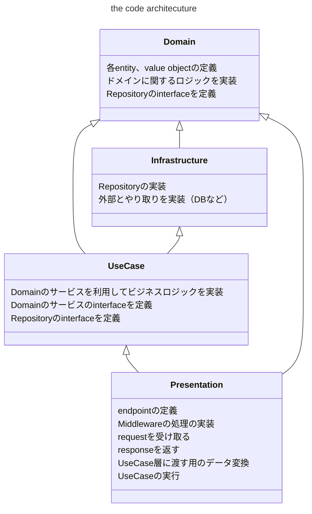

# Code architecture

```mermaid
---
title: the code architecuture
---
classDiagram

class Presentation {
	endpointの定義
	Middlewareの処理の実装
	requestを受け取る
	responseを返す
	UseCase層に渡す用のデータ変換
	UseCaseの実行
}
class UseCase {
	Domainのサービスを利用してビジネスロジックを実装
	Domainのサービスのinterfaceを定義
	Repositoryのinterfaceを定義
}
class Infrastructure {
	Repositoryの実装
	外部とやり取りを実装（DBなど）
}
class Domain {
	各entity、value objectの定義
	ドメインに関するロジックを実装
	Repositoryのinterfaceを定義
}

UseCase <|-- Presentation
Domain <|-- UseCase
Domain <|-- Infrastructure
Domain <|-- Presentation
Infrastructure <|-- UseCase


```