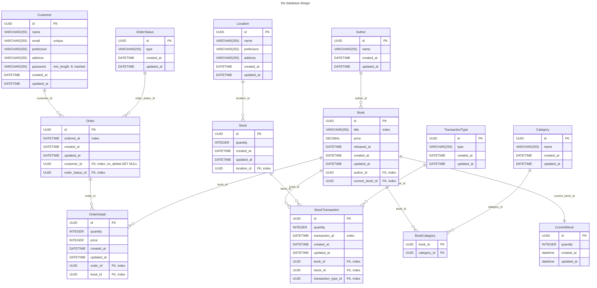

# ER diagram

```mermaid
---
title: the database design
---

erDiagram

Customer {
	UUID id "PK"
	VARCHAR(255) name
	VARCHAR(255) email "unique"
	VARCHAR(255) prefecture
	VARCHAR(255) address
	VARCHAR(255) password "min_length: 8, hashed"
	DATETIME created_at
	DATETIME updated_at
}

Order {
	UUID id "PK"
	DATETIME ordered_at "index"
	DATETIME created_at
	DATETIME updated_at
	UUID customer_id "FK, index, on_delete:SET NULL"
	UUID order_status_id "FK, index"
}

OrderStatus {
	UUID id "PK"
	VARCHAR(255) type
	DATETIME created_at
	DATETIME updated_at	
}

OrderDetail {
	UUID id "PK"
	INTEGER quantity
	INTEGER price
	DATETIME created_at
	DATETIME updated_at
	UUID order_id "FK, index"
	UUID book_id "FK, index"
}

Book {
	UUID id "PK"
	VARCHAR(255) title "index"
	DECIMAL price
	DATETIME released_at
	DATETIME created_at
	DATETIME updated_at
	UUID author_id "FK, index"
	UUID current_stock_id "FK, index"
}

CurrentStock {
	UUID id "PK"
	INTEGER quantity
	datetime created_at
	datetime updated_at
}

BookCategory {
	UUID book_id "PK"
	UUID category_id "PK"
}

Category {
	UUID id "PK"
	VARCHAR(255) name
	DATETIME created_at
	DATETIME updated_at
}

Stock {
	UUID id "PK"
	INTEGER quantity
	DATETIME created_at
	DATETIME updated_at
	UUID location_id "FK, index"
}

Location {
	UUID id "PK"
	VARCHAR(255) name
	VARCHAR(255) prefecture
	VARCHAR(255) address
	DATETIME created_at
	DATETIME updated_at
}

StockTransaction {
	UUID id "PK"
	INTEGER quantity
	DATETIME transaction_at "index"
	DATETIME created_at
	DATETIME updated_at
	UUID book_id "FK, index"
	UUID stock_id "FK, index"
	UUID transaction_type_id "FK, index"
}

TransactionType {
	UUID id "PK"
	VARCHAR(255) type
	DATETIME created_at
	DATETIME updated_at
}

Author {
	UUID id "PK"
	VARCHAR(255) name
	DATETIME created_at
	DATETIME updated_at
}

Customer ||--o{ Order : customer_id
Order ||--o{ OrderDetail : order_id
OrderStatus ||--o{ Order : order_status_id
Book ||--o{ OrderDetail : book_id
Book ||--o{ BookCategory : book_id
Book ||--|| CurrentStock : current_stock_id
Category ||--o{ BookCategory : category_id
Book ||--o{ StockTransaction : book_id
Stock ||--o{ StockTransaction : stock_id
TransactionType ||--o{ StockTransaction : transaction_type_id
Location ||--o{ Stock : location_id
Author ||--o{ Book : author_id
```
