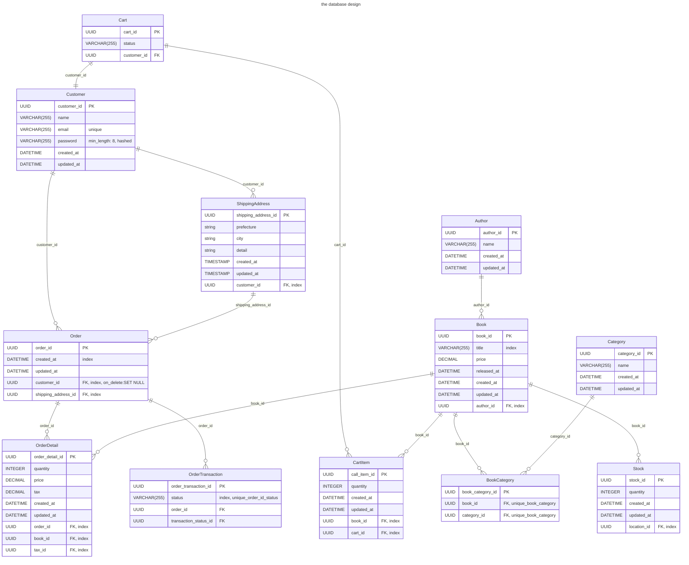

# ER diagram

```mermaid
---
title: the database design
---

erDiagram

Customer {
	UUID customer_id "PK"
	VARCHAR(255) name
	VARCHAR(255) email "unique"
	VARCHAR(255) password "min_length: 8, hashed"
	DATETIME created_at
	DATETIME updated_at
}

ShippingAddress {
	UUID shipping_address_id "PK"
	string prefecture
	string city
	string detail
	TIMESTAMP created_at
	TIMESTAMP updated_at
	UUID customer_id "FK, index"
}

Order {
	UUID order_id "PK"
	DATETIME created_at "index"
	DATETIME updated_at
	UUID customer_id "FK, index, on_delete:SET NULL"
	UUID shipping_address_id "FK, index"
}

OrderDetail {
	UUID order_detail_id "PK"
	INTEGER quantity
	DECIMAL price
	DECIMAL tax
	DATETIME created_at
	DATETIME updated_at
	UUID order_id "FK, index"
	UUID book_id "FK, index"
	UUID tax_id "FK, index"
}

OrderTransaction {
	UUID order_transaction_id "PK"
	VARCHAR(255) status "index, unique_order_id_status"
	UUID order_id "FK"
	UUID transaction_status_id "FK"
}

Cart {
	UUID cart_id "PK"
	VARCHAR(255) status
	UUID customer_id "FK"
}

CartItem {
	UUID call_item_id "PK"
	INTEGER quantity
	DATETIME created_at
	DATETIME updated_at
	UUID book_id "FK, index"
	UUID cart_id "FK, index"
}

Book {
	UUID book_id "PK"
	VARCHAR(255) title "index"
	DECIMAL price
	DATETIME released_at
	DATETIME created_at
	DATETIME updated_at
	UUID author_id "FK, index"
}

BookCategory {
	UUID book_category_id "PK"
	UUID book_id "FK, unique_book_category"
	UUID category_id "FK, unique_book_category"
}

Category {
	UUID category_id "PK"
	VARCHAR(255) name
	DATETIME created_at
	DATETIME updated_at
}

Stock {
	UUID stock_id "PK"
	INTEGER quantity
	DATETIME created_at
	DATETIME updated_at
	UUID location_id "FK, index"
}

Author {
	UUID author_id "PK"
	VARCHAR(255) name
	DATETIME created_at
	DATETIME updated_at
}

Customer ||--o{ Order : customer_id
Customer ||--o{ ShippingAddress : customer_id
ShippingAddress ||--o{ Order : shipping_address_id
Order ||--o{ OrderDetail : order_id
Order ||--o{ OrderTransaction : order_id
Cart ||--|| Customer : customer_id
Cart ||--o{ CartItem : cart_id
Book ||--o{ CartItem : book_id
Book ||--o{ OrderDetail : book_id
Book ||--o{ BookCategory : book_id
Category ||--o{ BookCategory : category_id
Book ||--o{ Stock : book_id
Author ||--o{ Book : author_id
```
